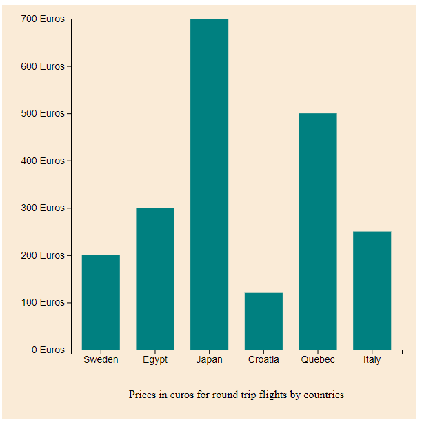

# D3.js - Data-Driven Documents

November 2020

> 🔨  **D3.js** is a JavaScript library for manipulating documents based on data. **D3** helps you bring data to life using HTML, SVG, and CSS. D3’s emphasis on web standards gives you the full capabilities of modern browsers without tying yourself to a proprietary framework, combining powerful visualization components and a data-driven approach to DOM manipulation.
>
> From Udemy: [La visualisation de données avec D3.js](https://www.udemy.com/course/la-visualisation-de-donnees-avec-d3/learn/)

* * *

<h1 align="center">
    
</h1>

## Demos

### Projects

**Demo 01:** Animated tile graphic with datas from Firebase and automatic udpate when we add, update
or delete data from the database.

- [Demo 01: Tile graph](https://raigyo.github.io/d3js-overview/demo-01-graph-tile.html)

**Demo 02:** Lorem ipsum Lorem ipsum Lorem ipsum Lorem ipsum Lorem ipsum

- [Demo 01: Pie graph](https://raigyo.github.io/d3js-overview/demo-02-graph-pie.html)

### Concepts and methods

- [SVG overview](https://raigyo.github.io/d3js-overview/assets/html/svg.html)
- [Simple graph using Json](https://raigyo.github.io/d3js-overview/assets/html/graph-tile-json.html)
- [Simple graph](https://raigyo.github.io/d3js-overview/assets/html/concepts-methods-axes.html)
- [Simple pie](https://raigyo.github.io/d3js-overview/assets/html/concept-methods-pie.html)
- [Color animation](https://raigyo.github.io/d3js-overview/assets/html/mouse-color-animation.html)
- [Interpolation-tween](https://raigyo.github.io/d3js-overview/assets/html/interpolation-tween.html)

## Useful links

- [Ziratsu/D3-Formation-CodeSource](https://github.com/Ziratsu/D3-Formation-CodeSource)
- [SVG W3C](https://www.w3.org/TR/SVG2/shapes.html)
- [D3Js](https://d3js.org/)
- [D3Js - github / reference](https://github.com/d3/d3)
- [D3.js Snippets](https://marketplace.visualstudio.com/items?itemName=hridoy.d3-js-snippets)
- [geeksforgeeks.org - D3.js](https://www.geeksforgeeks.org/tag/d3-js/)
- [Drawing axis in d3.js](https://www.d3-graph-gallery.com/graph/custom_axis.html)
- [D3 time formating example](https://bl.ocks.org/zanarmstrong/ca0adb7e426c12c06a95)
- [Get realtime updates with Cloud Firestore](https://firebase.google.com/docs/firestore/query-data/listen)